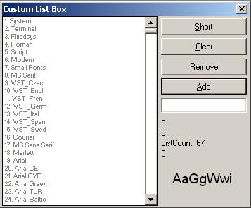



## Custom List Box

### Description

This is a very good example of how you can create your own custom list box. This code shows how can it be done but its not xactly a user control. the code is undestandable and the listbox is very flaxible. It uses a class to initialise the list. Hope u like it and drop a vote if u like it. (plz dont take this as a perfect project, I designed it to only show a listbox can be made. If u can enhance it plz share it with me}
 
### More Info
 

             |
---                |---
**Submitted On**   |2002-08-15 21:27:08
**By**             |[Zubuyer](https://github.com/Planet-Source-Code/PSCIndex/blob/master/ByAuthor/zubuyer.md)
**Level**          |Intermediate
**User Rating**    |5.0 (10 globes from 2 users)
**Compatibility**  |VB 6\.0
**Category**       |[Custom Controls/ Forms/  Menus](https://github.com/Planet-Source-Code/PSCIndex/blob/master/ByCategory/custom-controls-forms-menus__1-4.md)
**World**          |[Visual Basic](https://github.com/Planet-Source-Code/PSCIndex/blob/master/ByWorld/visual-basic.md)
**Archive File**   |[Custom\_Lis157125492003\.zip](https://github.com/Planet-Source-Code/zubuyer-custom-list-box__1-44623/archive/master.zip)

